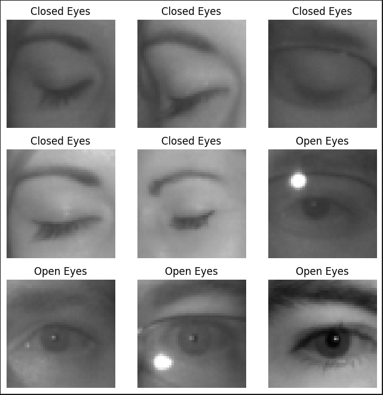

    

 

1. [Introduction](#introduction) 
    1.1 [Document Purpose](#document-purpose) 
    1.2 [Project Scope](#project-scope) 
    1.3 [Product Value](#product-value) 
    1.4 [Intended Audience](#intended-audience) 
    1.5 [References](#references) 

2. [Overall Description](#overall-description) 
    2.1 [Product Perspective](#product-perspective) 
    2.2 [User Classes and Characteristics](#user-classes-and-characteristics) 
    2.3 [Operating Environment](#operating-environment) 
    2.4 [Design and Implementation Constraints](#design-and-implementation-constraints) 
    2.5 [Assumptions and Dependencies](#assumptions-and-dependencies) 

3. [System Features](#system-features) 
    3.1 [Real-Time Eye Closure Detection](#real-time-eye-closure-detection) 
        &nbsp;&nbsp;&nbsp;&nbsp;3.1.1 [Description](#description) 
        &nbsp;&nbsp;&nbsp;&nbsp;3.1.2 [Functional Requirements](#functional-requirements) 
    3.2 [Alert System](#alert-system) 
        &nbsp;&nbsp;&nbsp;&nbsp;3.2.1 [Description](#description) 
        &nbsp;&nbsp;&nbsp;&nbsp;3.2.2 [Functional Requirements](#functional-requirements) 

4. [Data Requirements](#data-requirements) 
    4.1 [Model Data](#model-data) 
    4.2 [Data Dictionary](#data-dictionary) 
    4.3 [Data Integrity](#data-integrity) 
        &nbsp;&nbsp;&nbsp;&nbsp;4.3.1 [Training Data](#training-data) 
        &nbsp;&nbsp;&nbsp;&nbsp;4.3.2 [Captured Data](#captured-data) 

5. [Interface Requirements](#interface-requirements) 
    5.1 [User Interfaces](#user-interfaces) 
    5.2 [Hardware Interfaces](#hardware-interfaces) 
    5.3 [Software Interfaces](#software-interfaces) 

6. [Quality Attributes](#quality-attributes) 
    6.1 [Usability](#usability) 
    6.2 [Performance](#performance) 
    6.3 [Safety](#safety) 
    6.4 [Reliability](#reliability) 

7. [Non-Functional Requirements](#non-functional-requirements) 
    7.1 [Scalability](#scalability) 
    7.2 [Compatibility](#compatibility) 

8. [Glossary](#glossary) 

9. [Analysis Models](#analysis-models) 

# Introduction

## Document Purpose

&nbsp;&nbsp;&nbsp;&nbsp;&nbsp;&nbsp;The purpose of this document is to outline the requirements for the development of a IFS DriverAlert system that alerts drivers when it detects eye closure, aiming to reduce accidents caused by drowsy driving. This document will serve as a reference for the project team throughout the design, development, and testing phases, providing a clear understanding of the system's objectives, features, and constraints.

## Project Scope

&nbsp;&nbsp;&nbsp;&nbsp;&nbsp;&nbsp;The project aims to develop a driver drowsiness detection system that monitors a driver's eye closures and sounds an alert to prevent accidents caused by drowsy driving. The system will use a camera, a machine learning model, a Raspberry Pi 5 and a buzzer/speaker, enabling real-time detection of eye closures without requiring internet connectivity. The project will include the development of a Convolutional Neural Network (CNN) model for eye closure detection, integration of OpenCV for image processing, and implementation of an alert system using a buzzer or speaker.

&nbsp;&nbsp;&nbsp;&nbsp;&nbsp;&nbsp;The final product will be an `affordable`, `standalone`, `offline solution` that can be installed in any vehicle, making it accessible to a wide range of drivers. The project will focus on providing a practical, cost-effective alternative to the drowsiness detection systems currently found in high-end vehicles.

## Product Value

&nbsp;&nbsp;&nbsp;&nbsp;&nbsp;&nbsp;This driver drowsiness detection system enhances road safety by providing drivers with an affordable, accessible solution to reduce accidents caused by drowsiness. Unlike similar systems integrated into premium cars, this product is designed to be low-cost, easy to install, and capable of functioning offline, removing dependency on internet connectivity and costly high-end hardware.

&nbsp;&nbsp;&nbsp;&nbsp;&nbsp;&nbsp;The system's affordability and standalone nature make it a viable option for everyday drivers who seek enhanced safety without the need to invest in luxury vehicles. By offering this technology to a broader audience, the project aims to make a meaningful impact in reducing accidents, injuries, and fatalities related to drowsy driving.

## Intended Audience

This document is intended for the following audience:

- <b>Project Team:</b> The team members responsible for designing, developing, and testing the IFS DriverAlert system. This document will serve as a guide for ensuring alignment on project requirements and objectives throughout development.
- <b>Project Team:</b> The course instructor overseeing the project as part of the university curriculum. This document will provide the professor with a clear understanding of the project scope, objectives, and requirements.
- <b>Mentor:</b> The mentor assigned to regularly review project progress and offer support as needed. This document will help the mentor understand the project's direction, monitor adherence to requirements, and provide informed guidance.

## References

- <b>Driver Fatigue Detection Systems:</b>
    - <a href="https://carbuzz.com/car-advice/driver-fatigue-detection-systems-how-does-anti-sleep-tech-work" target="_blank" title="Volvo XC90">Driver Fatigue Detection Systems</a>: Overview of existing driver fatigue detection technologies used in high-end vehicles, explaining their features and functions.
    - <a href="https://www.tesla.com/ownersmanual/model3/en_eu/GUID-65BF21B8-50C5-4FA5-86A4-DA363DCD0484.html" target="_blank" title="Tesla">Tesla Model 3 Owner's Manual</a>: Details on Tesla's driver monitoring system, including its role in improving driver safety through fatigue detection.
- <b>Drowsiness Detection Datasets:</b>
    - <a href="https://www.kaggle.com/datasets/dheerajperumandla/drowsiness-dataset" target="_blank" title="Drowsiness_dataset">Drowsiness Dataset</a>: Contains images for open/closed eye states and yawning detection.
    - <a href="https://www.kaggle.com/datasets/prasadvpatil/mrl-dataset" target="_blank" title="MRL Eye Dataset">Drowsiness Detection Dataset</a>: Provides images of open and closed eyes to aid in eye closure detection modeling.

# Overall Description

## Product Perspective

&nbsp;&nbsp;&nbsp;&nbsp;&nbsp;&nbsp;The IFS DriverAlert system is designed as a standalone, accessible solution for detecting driver drowsiness through real-time eye closure monitoring. This system is intended for any standard vehicle and operates independently from any vehicle's integrated systems, which differentiate it from high-end drowsiness detection solutions in premium vehicles. By leveraging affordable hardware (RPi 5), along with open-source software and datasets, the system aims to make this safety technology accessible for all drivers, regardless of the vehicle model they own.

## User Classes and Characteristics

- <b>Everyday Drivers:</b> Individuals who prioritize safety and seek an affordable solution to reduce the risk of drowsy driving incidents. They may have limited technical knowledge and expect an easy-to-use system that integrates seamlessly into their vehicle.
- <b>Business Managers:</b> Businesses managing vehicles, such as trucking companies, looking to implement safety measures for their drivers.
- <b>University Stakeholders (Professor and Mentor):</b> Individuals, who are overseeing the project’s progress and development within an academic context, require a clear understanding of the system's design, purpose, and overall impact on road safety.

## Operating Environment

&nbsp;&nbsp;&nbsp;&nbsp;&nbsp;&nbsp;The IFS DriverAlert system is designed to be easily installed and used within any standard vehicle. It consists of a small, compact box that houses the Raspberry Pi 5 and a 12V to 5V power converter, connected to a camera and a speaker. This box can be placed in various positions in the car to suit the driver's preference, with the camera positioned to face the driver's face for effective monitoring. The system connects to the car's 12V power supply through a USB adapter, and the power converter reduces the voltage to 5V to run the Raspberry Pi. This setup enables the system to operate in diverse lighting conditions, including daylight, low-light, and nighttime environments, and it must be resilient to minor vibrations from vehicle movement.

## Design and Implementation Constraints

- <b>Computational Constraints:</b> The Raspberry Pi 5 has limited computational resources, necessitating an optimized model and code to ensure real-time performance without latency issues.
- <b>Lighting Variability:</b> Since lighting conditions inside a vehicle can vary significantly, the system must be robust to handle different lighting scenarios.
- <b>Privacy and Data Security:</b> To address privacy concerns, the system processes data in real-time without storing any captured images or video frames. This ensures that sensitive data is neither saved nor transmitted, aligning with privacy standards.

## Assumptions and Dependencies

- <b>Assumptions:</b>
    - The system will be positioned optimally in the vehicle to have a clear and unobstructed view of the driver’s eyes.
    - Drivers will use the system in a well-maintained vehicle environment, minimizing unexpected vibrations or obstructions.
    - The model will achieve an acceptable accuracy level in differentiating between open and closed eyes to provide reliable drowsiness detection.

- <b>Dependencies:</b>
    - The system relies on OpenCV for image processing and TensorFlow/Keras for machine learning model implementation. Compatibility with the Raspberry Pi 5 is essential for smooth operation.
    - The eye detection model is trained on a dataset from Kaggle, providing labeled images of open and closed eyes for model accuracy.
    - The system depends on a stable power supply within the vehicle through USB adapter.

# System Features

## Real-Time Eye Closure Detection

### Description

&nbsp;&nbsp;&nbsp;&nbsp;&nbsp;&nbsp;The real-time eye closure detection feature is the core component of the IFS DriverAlert. It uses a camera connected to a Raspberry Pi 5 to continuously monitor the driver's eyes. A Convolutional Neural Network (CNN) model, trained on images of open and closed eyes, will process the live video feed to detect when the driver's eyes are closed.

### Functional Requirements

- The system must be able to capture and process live video frames from the camera in real-time.
- The model should classify each frame as either "open eyes" or "closed eyes" with minimum latency.
- The detection model should be optimized to run on the Raspberry Pi, ensuring efficient use of CPU/GPU resources.
- The system should be accurate enough to reliably detect closed eyes and avoid false positives (e.g., blinking) as much as possible.
- The detection must work offline, without requiring an internet connection, for continuous functionality.

## Alert System

### Description

&nbsp;&nbsp;&nbsp;&nbsp;&nbsp;&nbsp;The alert system is designed to notify the driver whenever drowsiness is detected. When the model identifies a prolonged period of closed eyes, it triggers an audible alert through a buzzer or speaker. The alert aims to immediately capture the driver's attention and prevent potential accidents caused by drowsy driving. The system will continue to monitor and issue alerts if drowsiness continued.

### Functional Requirements

- The system must sound a buzzer or play a pre-recorded alert through a speaker when closed eyes are detected for a specified duration.
- The alert should be loud enough to ensure the driver hears it.
- The alert system should reset once the driver opens their eyes and remains alert, allowing it to monitor for future drowsiness episodes.

# Data Requirements

## Model Data

&nbsp;&nbsp;&nbsp;&nbsp;&nbsp;&nbsp;We are utilizing the _<a href="https://www.kaggle.com/datasets/prasadvpatil/mrl-dataset" target="_blank" title="MRL Eye Dataset">MRL Eye Dataset</a>_ which provides images of open and closed eyes. The decision to focus exclusively on the eye region is based on the following reasons:

- <b>Simpler and Faster:</b> Focusing on the eyes reduces the amount of data the model needs to process, enabling quicker and more efficient detection, especially on lower-power devices like the Raspberry Pi.
- <b>Targeted Detection:</b> Since drowsiness is primarily indicated by eye closure, using an eye-only dataset provides a focused approach that aligns well with the project's objective.
- <b>Less Data Required:</b> Training on eye images requires less labeled samples, which can reduce both the time and resources needed for model training.

## Data Dictionary

&nbsp;&nbsp;&nbsp;&nbsp;&nbsp;&nbsp;The data used for training and validating our drowsiness detection model consists of images categorized into two classes: `Closed Eyes` and `Open Eyes`. Each class represents a specific state of the driver's eyes, which the model will analyze in real-time to detect drowsiness.

The images below show the number of images available in each class:

The figure below provides a sample of images from each class:

The image above shows the variations within each class, highlighting different eye positions, which help improve the model's robustness.

## Data Integrity

### Training Data

&nbsp;&nbsp;&nbsp;&nbsp;&nbsp;&nbsp;The MRL Eye Dataset is licensed under a public domain dedication, allowing free usage, modification, distribution, and performance without permission. This permissive license ensures that our usage of the dataset adheres to legal and ethical standards, supporting the integrity of our project.

### Captured Data

&nbsp;&nbsp;&nbsp;&nbsp;&nbsp;&nbsp;For the operational system, all captured images are processed in real-time for drowsiness detection. No images are stored or saved, ensuring driver privacy and minimizing data retention concerns. This approach maintains data integrity by processing only the necessary visual data and disposing of it immediately after use.

# Interface Requirements

## User Interfaces

- <b>Power Connection:</b> The driver connects the step-down converter to the car's 12V power system via a USB port. The converter provides 5V power to the Raspberry Pi through a USB-C connection.
- <b>Switch/button:</b> The driver interacts with the system through a physical switch connected to the GPIO, enabling or disabling the program.
- <b>Speaker Alerts:</b> Alerts are provided through the speaker to notify the driver of detected drowsiness.
- <b>Camera Positioning:</b> The camera is positioned to face the driver and requires no further user interaction once set up.

## Hardware Interfaces

- <b>Power Source:</b>
    - <b>Input:</b> 12V DC from the car power system via a USB port.
    - <b>Output:</b> 5V DC provided to the Raspberry Pi through a step-down converter with a USB-C interface.
- <b>Camera:</b>
    - <b>Option 1:</b> Raspberry Pi Camera Module 3 connected via CSI (Camera Serial Interface).
    - <b>Option 2:</b> USB-connected HD Webcam 1080P.
- <b>Speaker:</b> Mini External USB Stereo Speaker connected directly to the Raspberry Pi via USB.
- <b>Switch/button:</b> Physical GPIO-connected switch or button for enabling/disabling the system.

## Software Interfaces

- <b>Operating System:</b> Raspberry Pi OS.
- <b>Programming Environment:</b> Python-based scripts for image processing and training the model.
- <b>Libraries and Frameworks:</b>
    - <b>OpenCV:</b> For capturing and processing the driver's face.
    - <b>MediaPipe:</b> For eye region detection.
    - <b>TensorFlow/Keras:</b> For running and training the CNN model to classify eye states.
    - <b>Additional libraries:</b> time, cv2, numpy, etc.
- <b>Script Execution:</b> The program runs automatically when the driver switches the system on, requiring no further work.
- <b>Model Training:</b> The model is trained in Google Colab, converted to TensorFlow Lite and transferred to the Raspberry Pi.

# Quality Attributes

## Usability

- The system should be user-friendly and requires minimal interaction from the driver. The driver will only be connecting the step-down converter to the car's power source and toggling the GPIO-connected switch to enable or disable the system.
- The audible alerts must be implemented to ensure accessibility without needing visual attention.

## Performance

- The system should operates in real-time with minimal latency to ensure immediate detection of drowsiness and timely alerts.
- The CNN model and optimized code need to run smoothly on the Raspberry Pi 5 considering its limited computational resources.

## Safety

- The system enhances driver safety by detecting drowsiness and sounding alerts to prevent potential accidents.
- Audible alerts are chosen over visuals to prevent drivers from looking away from the road.
- Data privacy is ensured as no images or videos are stored or transmitted, protecting user information.

## Reliability

- The system should be designed to function offline, to ensure it operates in environments with no internet connectivity.
- Hardware must be connected stably to ensure consistent performance in diverse vehicle movement conditions and the camera must work with diverse lighting.

# Non-Functional Requirements

## Scalability

- The system will be adapted to additional features such as integrating yawning detection or a visual user interface without significant hardware upgrades.
- The CNN model can be retrained on new datasets to enhance accuracy or include additional detection capabilities.

## Compatibility

- The system is compatible with standard 12V vehicle power systems and supports both CSI and USB camera connections.
- It runs on Raspberry Pi OS and is compatible with open-source libraries like OpenCV and TensorFlow Lite.

# Glossary

- <b>CNN (Convolutional Neural Network):</b> A type of deep learning model used for image classification tasks.
- <b>GPIO (General Purpose Input/Output):</b> Pins on the Raspberry Pi used for hardware interaction, such as connecting a switch, button, etc.
- <b>OpenCV:</b> An open-source computer vision library used for image processing.
- <b>MediaPipe:</b> A cross-platform framework used for building multimodal machine learning pipelines. In this project we are using it to capture the eye region so we can extract it and predict it against our model.
- <b>Raspberry Pi 5:</b> A compact computer used as the main hardware for this system.
- <b>Step-Down Converter:</b> A device that converts 12V to 5V for powering the Raspberry Pi.

# Analysis Models

- [Block Diagram](HardwareDiagrams/IFS_BlockDiagram.pdf)
- [Schematic Diagram](HardwareDiagrams/IFS_SchematicDiagram.pdf)
